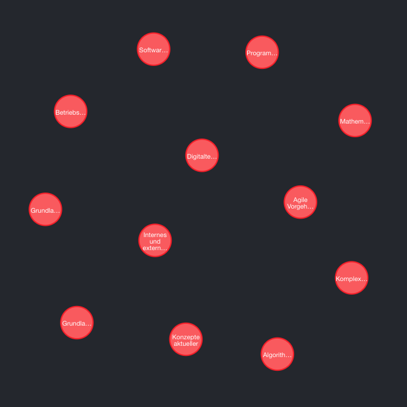
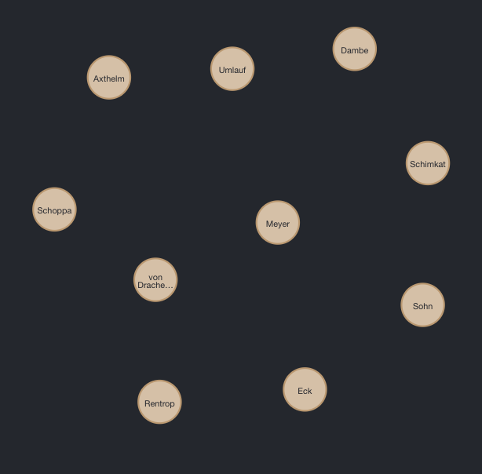

# Übungsblatt 2
### Aufgabe 1

```
MERGE (:Vorlesung {Titel:'Konzepte aktueller Datenbanksysteme', SWS: 3, ECTS: 5})
MERGE (:Vorlesung {Titel:'Algorithmentechnik', SWS: 2, ECTS: 3})
MERGE (:Vorlesung {Titel:'Komplexitätstheorie', SWS: 3, ECTS: 5})
MERGE (:Vorlesung {Titel:'Agile Vorgehensmodelle', SWS: 3, ECTS: 5})
MERGE (:Vorlesung {Titel:'Mathematik 1', SWS: 6, ECTS: 8})
MERGE (:Vorlesung {Titel:'Digitaltechnik', SWS: 6, ECTS: 8})
MERGE (:Vorlesung {Titel:'Programmiertechnik 1', SWS: 6, ECTS: 8})
MERGE (:Vorlesung {Titel:'Softwaremodellierung', SWS: 5, ECTS: 6})
MERGE (:Vorlesung {Titel:'Betriebswirtschaftslehre', SWS: 4, ECTS: 5})
MERGE (:Vorlesung {Titel:'Grundlagen der Gesundheitsinformatik und Studienmethodik', SWS: 5, ECTS: 7})
MERGE (:Vorlesung {Titel:'Grundlagen des Gesundheitswesens', SWS: 4, ECTS: 5})
MERGE (:Vorlesung {Titel:'Internes und externes Rechnungswesen', SWS: 4, ECTS: 5})
MERGE (:Vorlesung {Titel:'Reactive Systems', SWS: 4, ECTS: 5})
MERGE (:Vorlesung {Titel:'IT-Leadership', SWS: 4, ECTS: 5})
```




```
MERGE (:Professor {Name:'Eck'})
MERGE (:Professor {Name:'Meyer'})
MERGE (:Professor {Name:'Sohn'})
MERGE (:Professor {Name:'Schimkat'})
MERGE (:Professor {Name:'Dambe'})
MERGE (:Professor {Name:'Umlauf'})
MERGE (:Professor {Name:'Axthelm'})
MERGE (:Professor {Name:'Schoppa'})
MERGE (:Professor {Name:'von Drachenfels'})
MERGE (:Professor {Name:'Rentrop'})
MERGE (:Professor {Name:'Boger'})
```



```
MERGE (:Studiengang {Name:'Angewandte Informatik', Kuerzel:'AIN', Abschluss:'Bachelor'})
MERGE (:Studiengang {Name:'Gesundheitsinformatik', Kuerzel:'GIB', Abschluss:'Bachelor'})
MERGE (:Studiengang {Name:'Informatik', Kuerzel:'MSI', Abschluss:'Master'})
```


```
MATCH (p:Professor {Name: 'Eck'}) 
MATCH (s:Studiengang {Kuerzel: 'AIN'})
MERGE (p) -[r:ZUGEORDNET]-> (s);

MATCH (p:Professor {Name: 'Meyer'})
MATCH (s:Studiengang {Kuerzel: 'MSI'})
MERGE (p) -[r:ZUGEORDNET]-> (s);

MATCH (p:Professor {Name: 'Sohn'})
MATCH (s:Studiengang {Kuerzel: 'GIB'})
MERGE (p) -[r:ZUGEORDNET]-> (s);

MATCH (p:Professor {Name: 'Schimkat'})
MATCH (s:Studiengang {Kuerzel: 'MSI'})
MERGE (p) -[r:ZUGEORDNET]-> (s);

MATCH (p:Professor {Name: 'Dambe'})
MATCH (s:Studiengang {Kuerzel: 'GIB'})
MERGE (p) -[r:ZUGEORDNET]-> (s);

MATCH (p:Professor {Name: 'Umlauf'})
MATCH (s:Studiengang {Kuerzel: 'MSI'})
MERGE (p) -[r:ZUGEORDNET]-> (s);

MATCH (p:Professor {Name: 'Axthelm'})
MATCH (s:Studiengang {Kuerzel: 'AIN'})
MERGE (p) -[r:ZUGEORDNET]-> (s);

MATCH (p:Professor {Name: 'Schoppa'})
MATCH (s:Studiengang {Kuerzel: 'AIN'})
MERGE (p) -[r:ZUGEORDNET]-> (s);

MATCH (p:Professor {Name: 'von Drachenfels'})
MATCH (s:Studiengang {Kuerzel: 'AIN'})
MERGE (p) -[r:ZUGEORDNET]-> (s);

MATCH (p:Professor {Name: 'Rentrop'})
MATCH (s:Studiengang {Kuerzel: 'GIB'})
MERGE (p) -[r:ZUGEORDNET]-> (s);

MATCH (p:Professor {Name: 'Boger'})
MATCH (s:Studiengang {Kuerzel: 'AIN'})
MERGE (p) -[r:ZUGEORDNET]-> (s);
```


```
MATCH (v:Vorlesung {Titel:'Konzepte aktueller Datenbanksysteme'})
MATCH (s:Studiengang {Kuerzel: 'MSI'})
MERGE (v) -[:ENTHALTEN]-> (s);

MATCH (v:Vorlesung {Titel:'Algorithmentechnik'})
MATCH (s:Studiengang {Kuerzel: 'MSI'})
MERGE (v) -[:ENTHALTEN]-> (s);

MATCH (v:Vorlesung {Titel:'Komplexitätstheorie'})
MATCH (s:Studiengang {Kuerzel: 'MSI'})
MERGE (v) -[:ENTHALTEN]-> (s);

MATCH (v:Vorlesung {Titel:'Agile Vorgehensmodelle'})
MATCH (s:Studiengang {Kuerzel: 'MSI'})
MERGE (v) -[:ENTHALTEN]-> (s);

MATCH (v:Vorlesung {Titel:'Mathematik 1'})
MATCH (s:Studiengang {Kuerzel: 'AIN'})
MERGE (v) -[:ENTHALTEN]-> (s);

MATCH (v:Vorlesung {Titel:'Digitaltechnik'})
MATCH (s:Studiengang {Kuerzel: 'AIN'})
MERGE (v) -[:ENTHALTEN]-> (s);

MATCH (v:Vorlesung {Titel:'Programmiertechnik 1'})
MATCH (s:Studiengang {Kuerzel: 'AIN'})
MERGE (v) -[:ENTHALTEN]-> (s);

MATCH (v:Vorlesung {Titel:'Softwaremodellierung'})
MATCH (s:Studiengang {Kuerzel: 'AIN'})
MERGE (v) -[:ENTHALTEN]-> (s);

MATCH (v:Vorlesung {Titel:'Betriebswirtschaftslehre'})
MATCH (s:Studiengang {Kuerzel: 'GIB'})
MERGE (v) -[:ENTHALTEN]-> (s);

MATCH (v:Vorlesung {Titel:'Grundlagen der Gesundheitsinformatik und Studienmethodik'})
MATCH (s:Studiengang {Kuerzel: 'GIB'})
MERGE (v) -[:ENTHALTEN]-> (s);

MATCH (v:Vorlesung {Titel:'Grundlagen des Gesundheitswesens'})
MATCH (s:Studiengang {Kuerzel: 'GIB'})
MERGE (v) -[:ENTHALTEN]-> (s);

MATCH (v:Vorlesung {Titel:'Internes und externes Rechnungswesen'})
MATCH (s:Studiengang {Kuerzel: 'GIB'})
MERGE (v) -[:ENTHALTEN]-> (s);

MATCH (v:Vorlesung {Titel:'Reactive Systems'})
MATCH (s:Studiengang {Kuerzel: 'MSI'})
MERGE (v) -[:ENTHALTEN]-> (s);

MATCH (v:Vorlesung {Titel:'IT-Leadership'})
MATCH (s:Studiengang {Kuerzel: 'MSI'})
MERGE (v) -[:ENTHALTEN]-> (s);
```


```
MATCH (v:Vorlesung {Titel:'Konzepte aktueller Datenbanksysteme'})
MATCH (p:Professor {Name: 'Eck'})
MERGE (p) -[:HAELT {Semester: ['SS']}]-> (v);

MATCH (v:Vorlesung {Titel:'Algorithmentechnik'})
MATCH (p:Professor {Name: 'Umlauf'})
MERGE (p) -[:HAELT {Semester: ['SS']}]-> (v);

MATCH (v:Vorlesung {Titel:'Komplexitätstheorie'})
MATCH (p:Professor {Name: 'Meyer'})
MERGE (p) -[:HAELT {Semester: ['WS']}]-> (v);

MATCH (v:Vorlesung {Titel:'Agile Vorgehensmodelle'})
MATCH (p:Professor {Name: 'Schimkat'})
MERGE (p) -[:HAELT {Semester: ['WS']}]-> (v);

MATCH (v:Vorlesung {Titel:'Mathematik 1'})
MATCH (p:Professor {Name: 'Axthelm'})
MERGE (p) -[:HAELT {Semester: ['SS', 'WS']}]-> (v);

MATCH (v:Vorlesung {Titel:'Digitaltechnik'})
MATCH (p:Professor {Name: 'Schoppa'})
MERGE (p) -[:HAELT {Semester: ['SS', 'WS']}]-> (v);

MATCH (v:Vorlesung {Titel:'Programmiertechnik 1'})
MATCH (p:Professor {Name: 'von Drachenfels'})
MERGE (p) -[:HAELT {Semester: ['SS', 'WS']}]-> (v);

MATCH (v:Vorlesung {Titel:'Softwaremodellierung'})
MATCH (p:Professor {Name: 'Eck'})
MERGE (p) -[:HAELT {Semester: ['SS', 'WS']}]-> (v);

MATCH (v:Vorlesung {Titel:'Betriebswirtschaftslehre'})
MATCH (p:Professor {Name: 'Rentrop'})
MERGE (p) -[:HAELT {Semester: ['WS']}]-> (v);

MATCH (v:Vorlesung {Titel:'Grundlagen der Gesundheitsinformatik und Studienmethodik'})
MATCH (p:Professor {Name: 'Dambe'})
MERGE (p) -[:HAELT {Semester: ['WS']}]-> (v);

MATCH (v:Vorlesung {Titel:'Grundlagen des Gesundheitswesens'})
MATCH (p:Professor {Name: 'Sohn'})
MERGE (p) -[:HAELT {Semester: ['WS']}]-> (v);

MATCH (v:Vorlesung {Titel:'Internes und externes Rechnungswesen'})
MATCH (p:Professor {Name: 'Sohn'})
MERGE (p) -[:HAELT {Semester: ['SS']}]-> (v);

MATCH (v:Vorlesung {Titel:'Reactive Systems'})
MATCH (p:Professor {Name: 'Boger'})
MERGE (p) -[:HAELT {Semester: ['WS']}]-> (v);

MATCH (v:Vorlesung {Titel:'IT-Leadership'})
MATCH (p:Professor {Name: 'Boger'})
MERGE (p) -[:HAELT {Semester: ['WS']}]-> (v);
```


### Aufgabe 2
a) *Änderung: Welche AIN-Professoren halten im SS welche MSI Vorlesungen?*

```
MATCH (ainProf:Professor)-[:ZUGEORDNET]-(:Studiengang {Kuerzel:'AIN'})
MATCH (v:Vorlesung)-[:ENTHALTEN]->(:Studiengang{Kuerzel: 'MSI'})
MATCH (ainProf)-[r:HAELT]-(v)
WHERE ANY (x in r.Semester WHERE x = "SS")
RETURN ainProf, v
```


b) *Änderung: Welche AIN-Professoren halten im WS mehr als eine MSI Vorlesung mit mind. 5 ECTS?*

```
MATCH (ainProf:Professor)-[:ZUGEORDNET]-(:Studiengang {Kuerzel:'AIN'})
MATCH (v:Vorlesung)-[:ENTHALTEN]->(:Studiengang{Kuerzel: 'MSI'})
MATCH (ainProf)-[r:HAELT]-(v)
WHERE "WS" IN r.Semester
AND (v.ECTS > 4)
WITH ainProf, COUNT(v) AS c
WHERE (c > 1)
RETURN ainProf
```

c)

```
MATCH (s1:Studiengang) <- [:ZUGEORDNET] - (p:Professor) - [:HAELT] -> (v:Vorlesung) - [:ENTHALTEN] -> (s2:Studiengang)
WHERE s1 <> s2
RETURN p.Name AS Professor, s1.Kuerzel AS Studiengang, v.Titel AS Titel, s2.Kuerzel AS Kürzel
```

### Aufgabe 3

a)

```
MATCH((director:Person) - [:DIRECTED] -> (m:Movie) <- [:ACTED_IN] - (hanks:Person {name:"Tom Hanks"}))  return director, count() AS Anzahl 
ORDER BY Anzahl DESC
LIMIT 3
```

b)

```
MATCH(director:Person) - [:DIRECTED] -> (:Movie) <- [:ACTED_IN] - (actor:Person)
WHERE director <> actor
MERGE (director) - [:KNOWS] - (actor);
MATCH(actor1:Person) - [:ACTED_IN] -> (:Movie) <- [:ACTED_IN] - (actor2:Person)
WHERE actor1 <> actor2
MERGE (actor1) - [:KNOWS] - (actor2)
return actor1, actor2
```

```
MATCH ((p1:Person) - [k:KNOWS] -> (p2:Person))
return count()
```

c)

```
MATCH(fof:Person) - [:KNOWS] - (f:Person) - [:KNOWS] - (keanu:Person {name: "Keanu Reeves"})
WHERE NOT (fof) - [:KNOWS] - (keanu)
WHERE fof <> keanu
return distinct fof.name AS FriendOfFriendOfKeanu
```

d)

```
MATCH (keanu:Person{name:"Keanu Reeves"}), (kevin:Person{name:"Kevin Bacon"}),
p = shortestPath((keanu) -[:ACTED_IN*] - (kevin))
return p, length(p)/2
```